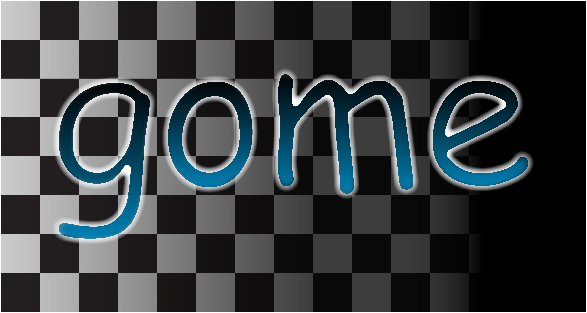

# Gome


This is a very robust game website, with a lot of cool features. 
Features:
 - Top bar info.
 - UI animations.
 - Game thumbnails. 
 - Runs offline(with local web server).
 - Game descriptions.
 - Easy game adding. 
 - Easy file structure.
 - Notification system. 
 - Holiday reminders(in case you forget that a holiday is on a certain day).
 - Game tagging
 - AND MORE...

[**Use the website!**](https://gomestable.netlify.app/)

## Development

This is made with CSS, HTML, and pure JavaScript. For the fonts, file-embedded base64 encoded fonts are used.

A JSON file is used for the game paths, tags, and descriptions. The file is named `games.json`(in the root directory). The JSON file structure is an array with the array name being the game name(the exact name of the folder), and the index 0 of the array is the description, and index 1 of the array is the tags, seperated by commas.

The previous implementation of this involved having 2 seperate files with the tags in one, and the descriptions in one. This should be simpler.

### Header Gradients

On certain dates, the header will have a different color. This is because the header has certain gradient colors associated with each date. 

Gradients are stored in the `index.html` file(in the `occasionColors` variable), and they support 3 color inputs. All colors must be in HEX format, and all dates must be in "Month-Day" format, where the month is the month and the day is the day. 

An example of a gradient that happens on November 2nd is below:

```
"11-2": ["#8a62c9ff", "#c21742", "#ff9797ff"],
```

## Adding games

To add a game, you have to first create a folder inside the `assets` folder. This will be the game's name. Inside that folder, you must have an image named `cover.png`. It must be in PNG format to work. That folder should also have an `index.html` file inside. 

It is also reccomended to reroute all reused assets(such as the WebGL logo and others) to the single `asset/globalUnityResources/` folder, which has custom SVG versions of some of the common images. This was done with the games on `gomestable.netlify.app`.

## Feedback

~~For connecting the feedback, Netlify functions is used, and is connected to a Discord webhook. The function on Netlify will send a POST request to Discord's webhook API, and return the status. For now, the avatar icon is just a picture of some potatoes. 🥔🥔🥔🥔~~ Feedback was dropped, due to Netlify needing a repository to be connected in order to actually use the functions.


## Development tools used

A wide variety of other tools(some closed source, but I will add them here anyway because they helped me) that were used during development are in this section(I am not being paid to promote any of these, they are just tools that I found helpful).

 - As of the 20th commit, [Coolors](https://coolors.co/palettes/) was used to get some of the colors for the header gradients.

 - VSCode was used as the development IDE. 

 - [Live Server](https://marketplace.visualstudio.com/items?itemName=ritwickdey.LiveServer) was used to preview the pages quickly without having to start up a local server in another application.
 - I recently added the [Lenis](https://github.com/darkroomengineering/lenis) library to the website, in order to support smooth scrolling, and make the website feel more unique and creative.

 - ~~To make the fonts base64 encoded, I used [Transfonter](https://transfonter.org/), which I highly recommend checking out if you want to make good single-file web apps.~~ This was removed due to the unneccesary refetching of the HTML file every time it got updated(which uses unneccesary bandwidth).

## Supporting

If you want to suggest anything, ask a question, or make a contribution, please open an issue. That will help me get to it more easily. I will try my best to respond to all of them to the best of my ability. 


